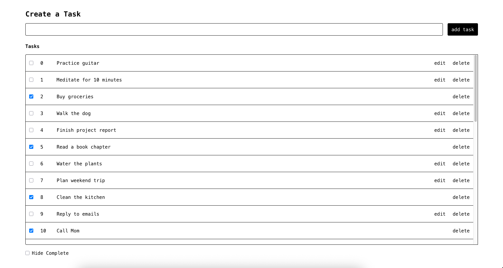

# Task Management App

A simple and intuitive task management web application that allows users to create, manage, and track their daily tasks.

## Features

- **Add Tasks:** Create a new task.
- **Edit Tasks:** Modify an existing task.
- **Delete Tasks:** Remove any task permanently.
- **Mark as Complete:** Click the checkbox to mark it as complete.
- **Hide Completed Tasks:** "Hide Complete" to filter out completed tasks.

## User Interface



## Installation

1. Clone the repository
2. Install dependencies:
```npm install```
3. Run the development server:
```npm num dev```
